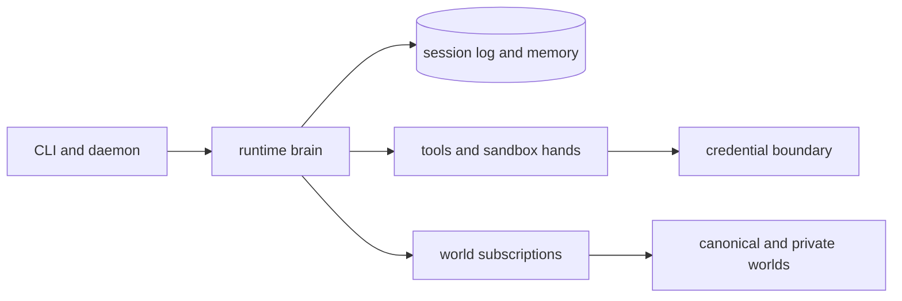

# Vivarium Agent

[](https://github.com/idanmann10/vivarium-agent/actions/workflows/ci.yml)
[](LICENSE)


local-first agent runtime with memory, Dream consolidation, world retrieval, a CLI, and a daemon.

Vivarium Agent is the per-user runtime for the Vivarium system. It runs goals through typed primitives,
records episodes in local state, retrieves skills and traces from subscribed worlds, consolidates experience
through Dream, and exposes local operations through CLI, daemon, and MCP-style surfaces.

## Production Status

The local runtime, CLI, daemon, world read paths, Dream candidate generation, safety checks, and documentation
gates are implemented and tested. The full `goal.md` v1 cultural-transmission proof is intentionally gated by
`doctor --live`; it still requires real provider keys, an internal API credential, other-agent evidence,
canonical-world publication evidence, and a two-week follow-up measurement.

Open-source production readiness means this repository has public setup, contribution, security, release, and
verification paths. It does not mean the live v1 evidence loop is complete.

## Architecture At A Glance

Vivarium keeps the agent brain, hands, session log, and credentials behind explicit interfaces:



- The brain is `packages/runtime`: Plan, Predict, Execute, Monitor, Recover, Validate, Reflect, Dream, and orchestration.
- The session log is `packages/state`: runs, episodes, memory, identity, confidence, and publishable artifacts.
- The hands are `packages/tools` and `packages/providers`: tool dispatch, provider calls, safety checks, and credential injection.
- The world boundary is `packages/world`: retrieval, subscriptions, proposals, publication, and GitHub paths.

Read [docs/architecture/managed-agent-model.md](docs/architecture/managed-agent-model.md) for the full
brain/hands/session/credential model.

## Quick Start

```bash
bun install
bun run lint
bun run knip
bun run public-release:scan
bun run typecheck
bun run test
bun run build
```

Set up a local coding agent against a sibling world checkout. This initializes
the state database, installs the starter pack, and prints the next commands in a
terminal-friendly checklist:

```bash
bun apps/cli/src/main.ts setup --domain coding --world-root ../the-world --state-path .vivarium/state.db
```

For live setup, copy the readiness template, restrict permissions, and let the
setup command dry-run the guarded provider and credential writes before you
confirm them:

```bash
cp docs/live-readiness.env.example live-readiness.local.env
chmod 600 live-readiness.local.env
bun apps/cli/src/main.ts setup --env-file live-readiness.local.env --domain coding --world-root ../the-world --state-path .vivarium/state.db
bun apps/cli/src/main.ts doctor --live --env-file live-readiness.local.env
```

Filled `live-readiness.local.env` files are ignored by git. Do not commit API keys, credential values,
provider secrets, or evidence files that contain private paths or private customer data.

## Repository Layout

- `apps/cli` - command surface for init, run, providers, credentials, world operations, publishing, and `doctor --live`.
- `apps/daemon` - local runtime host with status, run, Dream, HTTP transport, scheduler, and MCP manifest.
- `packages/core` - pure types, kernel, math, decision thresholds, and Claude Managed Agents compatibility types.
- `packages/state` - in-memory and SQLite repositories, migrations, memory systems, confidence buckets, and semantic facts.
- `packages/runtime` - Plan, Predict, Execute, Monitor, Recover, Validate, Reflect, Dream, attention, and orchestration.
- `packages/tools` - self-tools, external adapters, credentials, anonymization, and safety pipeline.
- `packages/providers` - Anthropic, OpenAI, OpenAI-compatible, local provider profiles, and routing.
- `packages/world` - world retrieval, subscriptions, proposals, visibility routing, and GitHub clients.
- `packages/eval` - deterministic compounding eval helpers.

## Verification

Use the narrowest command for scoped work, then run the full local gate before merging:

```bash
bun run lint
bun run knip
bun run public-release:scan
bun run typecheck
bun run test
bun run build
bun run format:check
```

Use `doctor --live` for production evidence. A green local test suite is not a substitute for live provider,
credential, GitHub, other-agent, or two-week improvement evidence.

## Project Policies

- Security reporting and secret-handling rules: [SECURITY.md](SECURITY.md)
- Support paths: [SUPPORT.md](SUPPORT.md)
- Contributor expectations: [CODE_OF_CONDUCT.md](CODE_OF_CONDUCT.md)
- Contribution workflow: [CONTRIBUTING.md](CONTRIBUTING.md)
- Release checklist: [RELEASING.md](RELEASING.md)
- License: [MIT](LICENSE)
- Documentation index: [docs/README.md](docs/README.md)

## Influences

- Superpowers: process-oriented skills and implementation discipline.
- GStack: role/command-shaped agent tooling and review surfaces.
