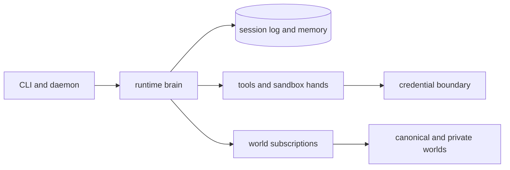

# Vivarium Agent

[](https://github.com/idanmann10/vivarium-agent/actions/workflows/ci.yml)
[](LICENSE)


Hermes-shaped local agent runtime: memory, tools, providers, Dream consolidation, world retrieval, and a terminal setup path that tells operators exactly what to do next.

Vivarium Agent is the per-user runtime for the Vivarium system. It runs goals through typed primitives, records episodes in local state, retrieves skills and traces from subscribed worlds, consolidates experience through Dream, and exposes local operations through CLI, daemon, and MCP-style surfaces.

```text
          .-""""-.
       .-'  .--.  '-.
      /   .' VI '.   \
     |    | VAR |    |    vivarium setup
      \   '.IUM.'   /     terminal-first, local-first
       '-.  '--'  .-'
          '-.__.-'
```

## Quick Start: Install in one command

Install into `~/.vivarium`, clone the canonical world beside the agent, install dependencies, add a `vivarium` command to `~/.local/bin`, and launch guided setup:

```bash
curl -fsSL https://raw.githubusercontent.com/idanmann10/vivarium-agent/main/scripts/install.sh | bash
```

Use `VIVARIUM_INSTALL_DIR`, `VIVARIUM_WORLD_ROOT`, `VIVARIUM_DOMAIN`, and `VIVARIUM_STATE_PATH` to override the default install layout. Use `VIVARIUM_BIN_DIR` to choose where the `vivarium` command is written.

Interactive terminals use the branded ANSI theme automatically. Set `VIVARIUM_COLOR=always` to force it, `VIVARIUM_COLOR=never` or `NO_COLOR` to disable it, or `FORCE_COLOR=1` when a wrapper strips TTY detection.

## Terminal-first setup

`vivarium setup` initializes local state, installs the starter pack, and prints the next terminal commands as a numbered launch sequence:

After installation, reload your shell if needed and run:

```bash
# [1] Prove the local loop
vivarium run --goal "validate local setup" --state-path .vivarium/state.db

# [2] Prepare live readiness
vivarium live env-init --path live-readiness.local.env
vivarium setup --env-file live-readiness.local.env --domain coding --world-root ../the-world --state-path .vivarium/state.db
vivarium setup --env-file live-readiness.local.env --domain coding --world-root ../the-world --state-path .vivarium/state.db --confirm-write

# [3] Inspect configured models
vivarium model --env-file live-readiness.local.env

# [4] Prepare live evidence
vivarium live evidence-init --path v1-evidence.json

# [5] Run the readiness gate
vivarium doctor --live --env-file live-readiness.local.env

# [6] Keep moving
vivarium status
vivarium help
vivarium update
```

For a source checkout, run the same setup directly:

```bash
bun install
vivarium setup --domain coding --world-root ../the-world --state-path .vivarium/state.db
```

Filled `live-readiness.local.env` files are ignored by git. Do not commit API keys, credential values, provider secrets, or evidence files that contain private paths or private customer data.

## Architecture At A Glance

Vivarium keeps the agent brain, hands, session log, and credentials behind explicit interfaces:



- The brain is `packages/runtime`: Plan, Predict, Execute, Monitor, Recover, Validate, Reflect, Dream, and orchestration.
- The session log is `packages/state`: runs, episodes, memory, identity, confidence, and publishable artifacts.
- The hands are `packages/tools` and `packages/providers`: tool dispatch, provider calls, safety checks, and credential injection.
- The world boundary is `packages/world`: retrieval, subscriptions, proposals, publication, and GitHub paths.

Read [docs/architecture/managed-agent-model.md](docs/architecture/managed-agent-model.md) for the full brain/hands/session/credential model.

## What grows over time

Vivarium is built so an agent gets better by living through work instead of being reprompted by hand:

| Layer | What compounds |
| --- | --- |
| Episodic memory | Runs, observations, surprises, validations, and recoveries |
| Procedural memory | Skills promoted by successful reuse and pruned by evidence |
| Semantic memory | Facts learned from repeated tool, provider, and workflow behavior |
| Identity | Dream-generated summary of habits, calibration, and stage |
| World culture | Public skills, traces, anti-patterns, runs, curricula, and trust signals |

## Production Status

The local runtime, CLI, daemon, world read paths, Dream candidate generation, safety checks, installer, public docs, and documentation gates are implemented and tested. The full `goal.md` v1 cultural-transmission proof is intentionally gated by `doctor --live`; it still requires real provider keys, an internal API credential, other-agent evidence, canonical-world publication evidence, and a two-week follow-up measurement.

Open-source production readiness means this repository has public setup, contribution, security, release, and verification paths. It does not mean the live v1 evidence loop is complete.

## Release boundary

Use the local gates to verify implementation health:

```bash
bun run lint
bun run knip
bun run public-release:scan
bun run typecheck
bun run test
bun run build
bun run format:check
```

Use `doctor --live` for production evidence. A green local test suite is not a substitute for live provider, credential, GitHub, other-agent, or two-week improvement evidence. Full v1 is only ready when a fresh live doctor returns `ok:true`.

## Repository Layout

- `apps/cli` - command surface for init, run, providers, credentials, world operations, publishing, and `doctor --live`.
- `apps/daemon` - local runtime host with status, run, Dream, HTTP transport, scheduler, and MCP manifest.
- `packages/core` - pure types, kernel, math, decision thresholds, and Claude Managed Agents compatibility types.
- `packages/state` - in-memory and SQLite repositories, migrations, memory systems, confidence buckets, and semantic facts.
- `packages/runtime` - Plan, Predict, Execute, Monitor, Recover, Validate, Reflect, Dream, attention, and orchestration.
- `packages/tools` - self-tools, external adapters, credentials, anonymization, and safety pipeline.
- `packages/providers` - Anthropic, OpenAI, OpenAI-compatible, local provider profiles, and routing.
- `packages/world` - world retrieval, subscriptions, proposals, visibility routing, and GitHub clients.
- `packages/eval` - deterministic compounding eval helpers.

## Project Policies

- Security reporting and secret-handling rules: [SECURITY.md](SECURITY.md)
- Support paths: [SUPPORT.md](SUPPORT.md)
- Contributor expectations: [CODE_OF_CONDUCT.md](CODE_OF_CONDUCT.md)
- Contribution workflow: [CONTRIBUTING.md](CONTRIBUTING.md)
- Release checklist: [RELEASING.md](RELEASING.md)
- License: [MIT](LICENSE)
- Documentation index: [docs/README.md](docs/README.md)

## Influences

- Superpowers: process-oriented skills and implementation discipline.
- GStack: role/command-shaped agent tooling and review surfaces.
