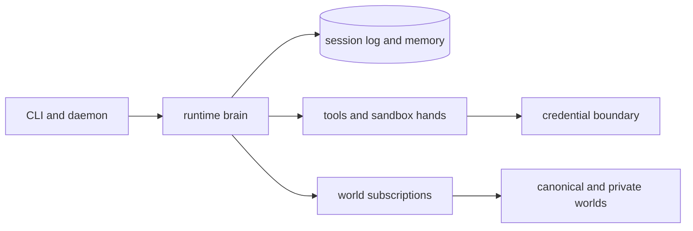

# Vivarium Agent

[](https://github.com/idanmann10/vivarium-agent/actions/workflows/ci.yml)
[](LICENSE)


Hermes-shaped local-first agent runtime: memory, tools, providers, Dream consolidation, world retrieval, and a terminal setup path that tells operators exactly what to do next.

Vivarium Agent is the per-user runtime for the Vivarium system. It runs goals through typed primitives, records episodes in local state, retrieves skills and traces from subscribed worlds, consolidates experience through Dream, and exposes local operations through CLI, daemon, and MCP-style surfaces.

```text
 __      __ _____ __      __    _     ____  ___  _   _  __  __
 \ \    / /|_   _|\ \    / /   / \   |  _ \|_ _|| | | ||  \/  |
  \ \  / /   | |   \ \  / /   / _ \  | |_) || | | | | || |\/| |
   \ \/ /    | |    \ \/ /   / ___ \ |  _ < | | | |_| || |  | |
    \__/    |____|   \__/   /_/   \_\|_| \_\___| \___/ |_|  |_|
            VIVARIUM // local memory // world culture
```

## Quick Start: Install in one command

Install into `~/.vivarium`, clone the canonical world beside the agent, install dependencies, add a `vivarium` command to `~/.local/bin`, and launch guided setup:

```bash
curl -fsSL https://raw.githubusercontent.com/idanmann10/vivarium-agent/main/scripts/install.sh | bash
```

Most users do not need to set environment variables before the first run. The
installer infers public repo metadata, creates local state, and prints the next
agent commands. Advanced install overrides live in
[docs/guides/install.md](docs/guides/install.md).

On macOS, add the opt-in LaunchAgent deployment when you want the local daemon
installed and started in the same setup pass:

```bash
curl -fsSL https://raw.githubusercontent.com/idanmann10/vivarium-agent/main/scripts/install.sh | VIVARIUM_DAEMON=launchd bash
```

This writes `~/Library/LaunchAgents/com.vivarium.agent.daemon.plist`, starts the daemon with `launchctl`, and prints a `vivarium daemon smoke` command for `http://127.0.0.1:8787/status`. The LaunchAgent daemon uses the same installer-selected state path, so `vivarium daemon smoke` reports the durable local memory backing the daemon.

Interactive terminals use the branded ANSI theme automatically. Set `VIVARIUM_COLOR=always` to force it, `VIVARIUM_COLOR=never` or `NO_COLOR` to disable it, or `FORCE_COLOR=1` when a wrapper strips TTY detection. Set `VIVARIUM_THEME=matrix` or `VIVARIUM_THEME=amber` for alternate ASCII-art palettes.

## Terminal-first setup

`vivarium local` creates a named `local-agent`, initializes SQLite state under
`~/.vivarium`, installs the coding starter pack, stages
`~/.vivarium/live/live-readiness.local.env` for later, and prints a local-first
numbered launch sequence. The installer runs the same quick setup
automatically.

After installation, reload your shell if needed and run:

```bash
# [1] Initialize local memory
vivarium local

# [2] Run the local agent
vivarium local run

# [3] Review launch handoff
vivarium launch handoff

# [4] Keep moving
vivarium status
vivarium help
vivarium update
```

That first run is fully offline. It uses the built-in local provider, records
the run in local SQLite memory, shows the `~/.vivarium/state.db` memory path,
and reports the skills, traces, prediction,
validation, and next local commands. Connect Anthropic, OpenRouter, or a private
OpenAI-compatible endpoint only when you want real model calls.
Use `vivarium status` after a run to confirm the latest local run goal, run ID,
success state, and score from SQLite before moving on.
The installed `vivarium` command preserves the installer-selected domain, world
root, state path, and live-readiness file as overridable defaults, so
`vivarium local run` stays enough after custom-path or branch-pinned installs.
Copy the exact installer-printed `vivarium local run` command only when you are
running outside the installed wrapper.
`vivarium status --state-path <file> --live-env-path <file>` keeps those
explicit paths in its next `vivarium local run` and `vivarium connect` commands,
so custom-path smokes do not drift back to default state.
Run `vivarium launch handoff --help` when you need the branch/ref, daemon, or
reviewer flags for pre-main Mac handoffs.
If you run `vivarium local run` before `vivarium local`, the command seeds the same starter memory, stages the private live-readiness file, and then runs the local agent against that durable state.
If the local SQLite state file is invalid, `vivarium local run` stops before writing new run data, names the damaged path, and points you at `vivarium doctor` plus `vivarium local` so you can move the file aside and reseed it.

When installed with the LaunchAgent option, verify the local daemon separately:

```bash
vivarium daemon smoke
```

Use `vivarium launch handoff` when you are ready for production evidence. That
command explains provider keys, live smoke tests, and the v1 evidence gate
without blocking the local agent loop.

Use `vivarium setup live` when you are ready to create provider keys with the
default private directories. It creates `~/.vivarium/secrets` for local secret
files and `~/.vivarium/live` for generated provider, credential, and evidence
artifacts, then runs the guided live setup flow. `vivarium onboard live` remains
available as the same live setup wizard.

`vivarium connect signup` reopens model provider, GitHub/public release, and internal credential handoff guidance without showing raw env-key wiring. It also shows a local value map for generated files such as `~/.vivarium/secrets/anthropic.key` and `~/.vivarium/secrets/internal-health-url.txt`, so setup stays in paste-once local files instead of shell exports.

Live setup path:

```bash
vivarium setup live
vivarium connect signup
# Paste requested values into ~/.vivarium/secrets, then:
vivarium setup live
vivarium connect
vivarium connect setup --confirm-write
vivarium connect smoke
vivarium proof init
vivarium proof
vivarium doctor --live
```

`vivarium connect` turns the setup file into a plain-language names/world,
GitHub/public release, provider, internal credential, and evidence readiness
dashboard without printing raw env-key wiring unless you pass `--details`. Use
`vivarium proof` to review the v1 evidence checklist in plain language before
the stricter live doctor gate.
New env files include public-provider model defaults for Anthropic and
OpenRouter, so first-time setup starts with signup keys plus the private/internal
values.

### Advanced live setup controls

Use `vivarium connect wizard` only when you want to choose those paths yourself. It
creates or reuses the private `~/.vivarium/live/live-readiness.local.env` setup
file by default, shows the Anthropic and OpenRouter key pages plus the private
endpoint handoff, and can write friendly file-backed setup values in the same
command. Prefer the `--secrets-dir ~/.vivarium/secrets` shortcut so secrets stay
in local files and do not sit in shell history. Add
`--setup-dir ~/.vivarium/live` to put generated provider profiles, the encrypted
credential store, and the evidence manifest in one local directory. Pass
`--confirm-write` after reviewing those values to save those files without a
separate setup step.

For a source checkout in the standard sibling layout (`the-agent` beside
`the-world`), use the one-command local proof path:

```bash
bun install
bun run quickstart
```

That runs local setup and a deterministic local goal. If you want to run the
steps separately, use the local shortcuts:

```bash
bun run local
bun run local:run
```

For custom paths, use `bun run vivarium -- local` and pass `--world-root` or
`--state-path` explicitly.

Filled `live-readiness.local.env` files are ignored by git. Do not commit API keys, credential values, provider secrets, or evidence files that contain private paths or private customer data.

When the public repository names are already settled, prefill the non-secret
GitHub and world values while creating the default private setup file:

```bash
vivarium setup \
  --quick \
  --domain coding \
  --world-root ../the-world \
  --state-path .vivarium/state.db \
  --github-owner idanmann10 \
  --agent-repo vivarium-agent \
  --world-repo vivarium-world \
  --canonical-world-ref https://github.com/idanmann10/vivarium-world.git \
  --private-world-ref git@github.com:idanmann10/vivarium-world-private.git
```

## Architecture At A Glance

Vivarium keeps the agent brain, hands, session log, and credentials behind explicit interfaces:



- The brain is `packages/runtime`: Plan, Predict, Execute, Monitor, Recover, Validate, Reflect, Dream, and orchestration.
- The session log is `packages/state`: runs, episodes, memory, identity, confidence, and publishable artifacts.
- The hands are `packages/tools` and `packages/providers`: tool dispatch, provider calls, safety checks, and credential injection.
- The world boundary is `packages/world`: retrieval, subscriptions, proposals, publication, and GitHub paths.

Read [docs/architecture/managed-agent-model.md](docs/architecture/managed-agent-model.md) for the full brain/hands/session/credential model.

## What grows over time

Vivarium is built so an agent gets better by living through work instead of being reprompted by hand:

| Layer | What compounds |
| --- | --- |
| Episodic memory | Runs, observations, surprises, validations, and recoveries |
| Procedural memory | Skills promoted by successful reuse and pruned by evidence |
| Semantic memory | Facts learned from repeated tool, provider, and workflow behavior |
| Identity | Dream-generated summary of habits, calibration, and stage |
| World culture | Public skills, traces, anti-patterns, runs, curricula, and trust signals |

## Production Status

The local runtime, CLI, daemon, world read paths, Dream candidate generation, safety checks, installer, public docs, and documentation gates are implemented and tested. The full `goal.md` v1 cultural-transmission proof is intentionally gated by `doctor --live`; it still requires real provider keys, an internal API credential, other-agent evidence, canonical-world publication evidence, and a two-week follow-up measurement.

Open-source production readiness means this repository has public setup, contribution, security, release, and verification paths. It does not mean the live v1 evidence loop is complete.

## Release boundary

Use the local gates to verify implementation health:

```bash
bun run lint
bun run knip
bun run public-release:scan
bun run typecheck
bun run test
bun run build
bun run format:check
bun run dependency:audit
```

Use `vivarium proof` for the human-readable
evidence checklist and `doctor --live` for the production gate. A green local
test suite is not a substitute for live provider, credential, GitHub,
other-agent, or two-week improvement evidence. Full v1 is only ready when a
fresh live doctor returns `ok:true`.

## Repository Layout

- `apps/cli` - command surface for init, run, providers, credentials, world operations, publishing, and `doctor --live`.
- `apps/daemon` - local runtime host with status, run, Dream, HTTP transport, scheduler, and MCP manifest.
- `packages/core` - pure types, kernel, math, decision thresholds, and Claude Managed Agents compatibility types.
- `packages/state` - in-memory and SQLite repositories, migrations, memory systems, confidence buckets, and semantic facts.
- `packages/runtime` - Plan, Predict, Execute, Monitor, Recover, Validate, Reflect, Dream, attention, and orchestration.
- `packages/tools` - self-tools, external adapters, credentials, anonymization, and safety pipeline.
- `packages/providers` - Anthropic, OpenAI, OpenAI-compatible, local provider profiles, and routing.
- `packages/world` - world retrieval, subscriptions, proposals, visibility routing, and GitHub clients.
- `packages/eval` - deterministic compounding eval helpers.

## Project Policies

- Security reporting and secret-handling rules: [SECURITY.md](SECURITY.md)
- Support paths: [SUPPORT.md](SUPPORT.md)
- Contributor expectations: [CODE_OF_CONDUCT.md](CODE_OF_CONDUCT.md)
- Contribution workflow: [CONTRIBUTING.md](CONTRIBUTING.md)
- Release checklist: [RELEASING.md](RELEASING.md)
- License: [MIT](LICENSE)
- Documentation index: [docs/README.md](docs/README.md)

## Influences

- Superpowers: process-oriented skills and implementation discipline.
- GStack: role/command-shaped agent tooling and review surfaces.
