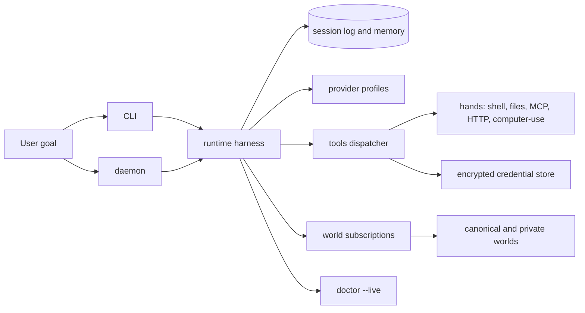

# Managed-Agent Model

Vivarium is local-first, but it follows the same interface discipline as a managed-agent runtime: keep the
agent brain, session log, hands, and credentials separate enough that each can be replaced, inspected, or
recovered without pretending the whole system is one durable process.

## Stable Interfaces

The runtime harness is the brain-side loop. It sequences Plan, Predict, Execute, Monitor, Recover, Validate,
Reflect, and Dream, then writes inspectable episodes to the session log through the state repository.

The hands are the action surfaces: shell, files, MCP manifest tools, HTTP adapters, provider calls, and
computer-use adapters. Hands are reached through `packages/tools` so safety checks, prompt-injection warnings,
rate limits, audit events, and credential injection happen at one boundary.

The session log is not the model context window. It is durable state: runs, episodes, confidence buckets,
semantic facts, procedural skills, identity, publishable artifacts, world subscriptions, and Dream outputs.
The harness can summarize or select from this state, but the original evidence remains inspectable.

## Credential Boundary

Secrets do not belong in prompts, world artifacts, run bodies, traces, or published skills. Provider profiles
name API key environment variables, and the encrypted credential store holds internal API credentials behind
an explicit master key.

Credential use enters through the tools dispatcher or provider adapters. This credential boundary keeps the
sandbox and generated tool arguments from directly owning secrets, and it gives `doctor --live` concrete smoke
checks for provider profiles and the encrypted credential store.

## World Boundary

World subscriptions are separate from runtime state. The agent can pull from canonical and private worlds,
search skills and traces, and propose or publish artifacts back through visibility-aware paths. Public
publication requires anonymization and review gates; private-world artifacts can stay local or internal.

The canonical world is intentionally Git-hosted. That makes skill lineage, proposals, featured picks, trust
metadata, maintainer veto windows, and auto-merge evidence visible outside the local agent process.

## Operator Surfaces

`apps/cli` is the short-lived operator surface for init, run, provider, credential, world, GitHub, and
`doctor --live` workflows.

`apps/daemon` is the long-running local host for status, run, Dream, scheduler, HTTP transport, and MCP
manifest exposure.

`doctor --live` is the production boundary. Local tests prove implementation contracts; the live doctor
requires real provider smokes, encrypted credential smokes, GitHub checks, publication evidence, other-agent
evidence, curation evidence, and the two-week improvement loop before the v1 proof is complete.
